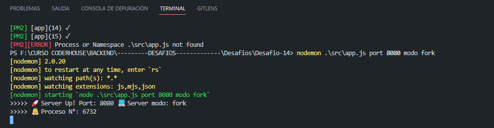
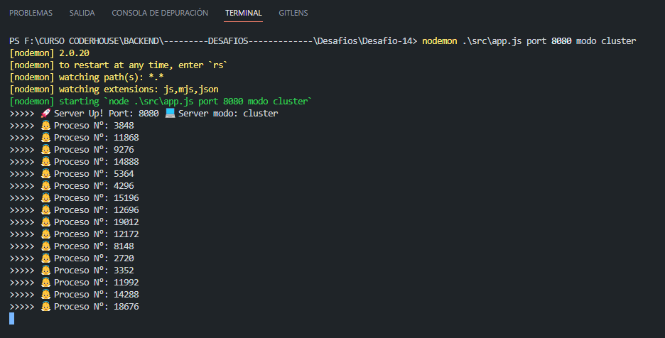
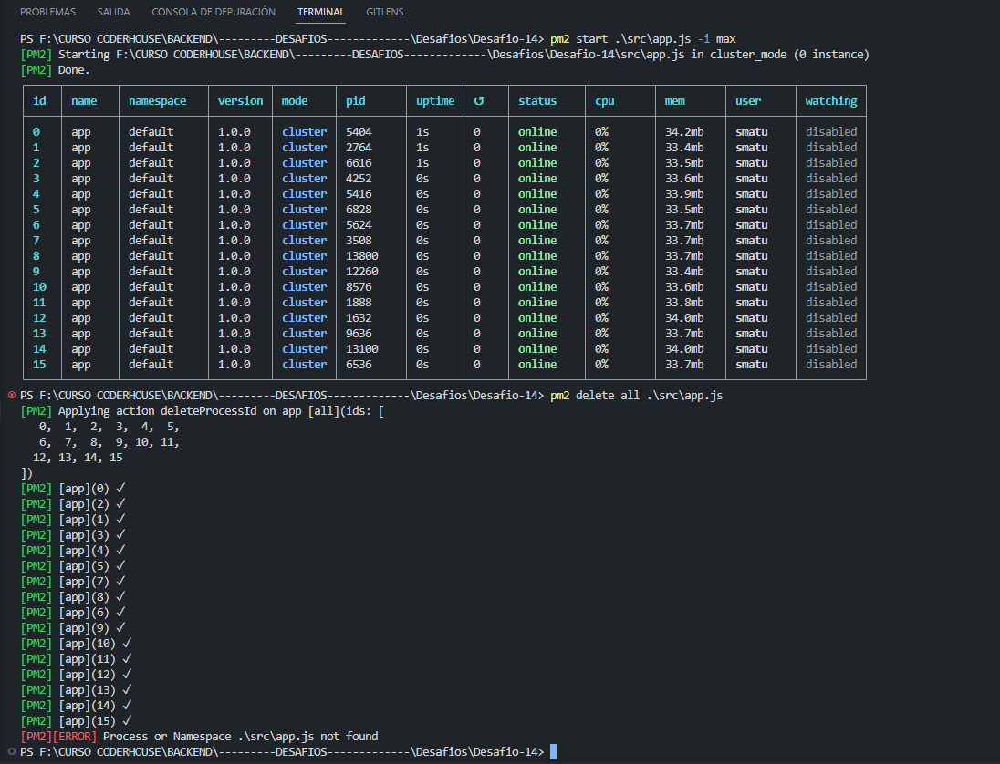
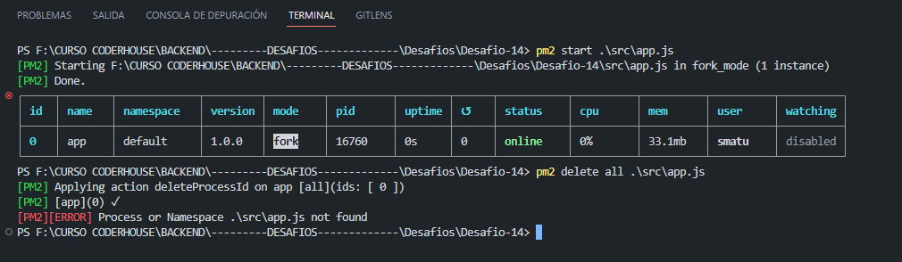
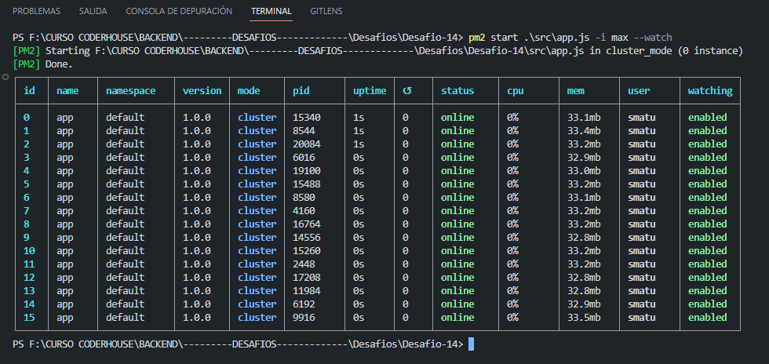
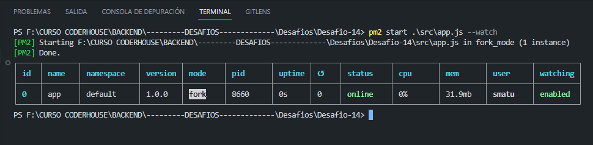
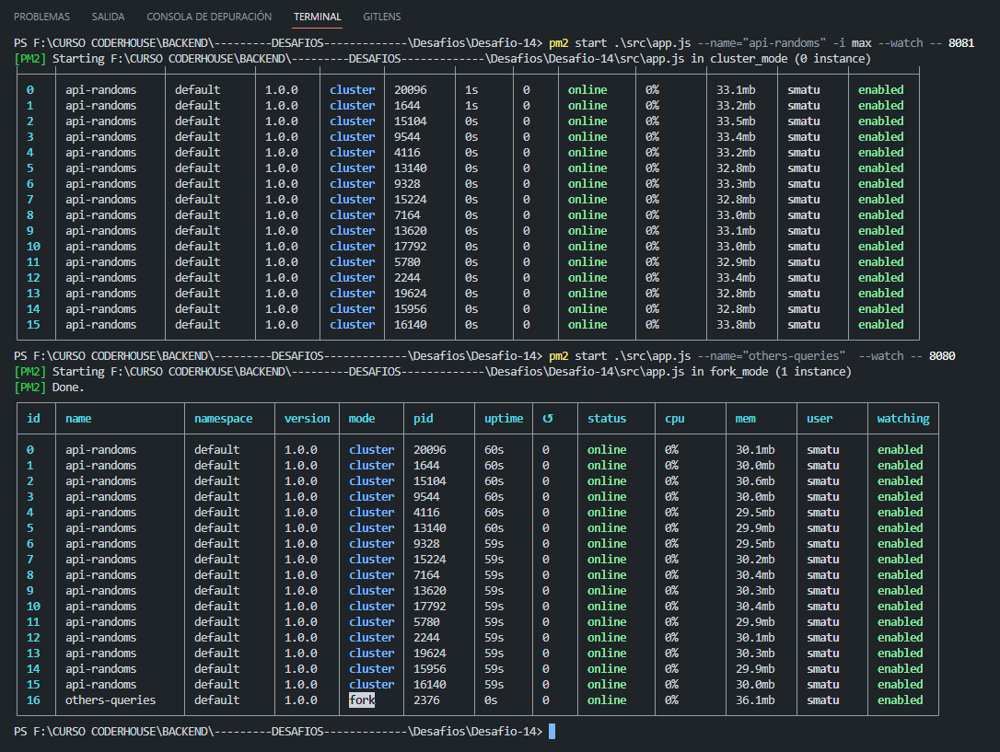

# Desafio 14 Curso Backend

## Servidor con balance de carga

## Comenzamos:

### Ejecutar el proyecto:

Para ejecutar el proyecto, el mismo puede descargarse como .zip o git clone.

[Clic aqui para descargar repo formato zip](https://github.com/matsanchez/desafio14-backend/archive/refs/heads/main.zip)

Copiar y pegar en la terminal :

```
git clone https://github.com/matsanchez/desafio14-backend.git
```

> Instalar las dependencias:

```
npm install
```

> Poner a escuchar MySql:

```
Usando XAMPP Control Panel o el que utilices, siempre y cuando quieras realizar pruebas de autentificacion y uso de websockets, para el resto de las funciones no hace falta.
```

> Iniciar NGINX

```
Desde la ruta raiz de la carpeta nginx (incluida en el repo por si no la tienes) abrir consola y ejecutar start .\nginx.exe
```

**Consigna:**
Tomando con base el proyecto que vamos realizando, agregar un parámetro más en
la ruta de comando que permita ejecutar al servidor en modo fork o cluster. Dicho
parámetro será 'FORK' en el primer caso y 'CLUSTER' en el segundo, y de no
pasarlo, el servidor iniciará en modo fork.

> Modos de ejecucion Local:
>
> > Usando process

```
node .\src\app.js port (numero) modo (cluster o fork)
"Ej: node .\src\app.js port 8020 modo fork"

node .\src\app.js (por defecto se conecta al puerto 8080 y modo fork)
```

> > Usando Nodemon

```
npm run dev (modo developer) Nodemon --- por defecto usa puerto: 8080
```

```
Ingresas en el navegador http://localhost
```

> > Agregar en la vista info, el número de procesadores presentes en el servidor.

```
Ingresas en el navegador http://localhost/info
```

**Consigna:**
Configurar Nginx para balancear cargas de nuestro servidor de la siguiente manera:
Redirigir todas las consultas a /api/randoms a un cluster de servidores escuchando en el puerto 8081. El cluster será creado desde node utilizando el módulo nativo cluster.
El resto de las consultas, redirigirlas a un servidor individual escuchando en el puerto 8080.
Verificar que todo funcione correctamente.

    IMPORTANTE: Previo ejecutar el server en los puertos correspondientes a la consigna, ejemplo:
    pm2 start .\src\app.js --name="others-queries"  --watch -- 8080
    pm2 start .\src\app.js --name="api-randoms"  --watch -- 8081
    ```
    Para esta consigna dentro de la carpeta nginx/config usamos el nginx.conf

    worker_processes  1;

events {
worker_connections 1024;
}

http {
include mime.types;
default_type application/octet-stream;

    upstream node_app {
        server localhost:8080;
    }

    upstream node_app_random {
        server localhost:8081;
    }

    sendfile        on;
    keepalive_timeout  65;

    server {
        listen       80;
        server_name  localhost;

        location / {
            root   "F:\CURSO CODERHOUSE\BACKEND\---------DESAFIOS-------------\Desafios\Desafio-14\src\public";
            index  index.html index.htm;
        }

        location /info {
            proxy_pass http://node_app;
        }

        location /api/randoms{
            proxy_pass http://node_app_random;
        }
    }

}
```
Luego, modificar la configuración para que todas las consultas a /api/randoms sean redirigidas a
un cluster de servidores gestionado desde nginx, repartiéndolas equitativamente entre 4
instancias escuchando en los puertos 8082, 8083, 8084 y 8085 respectivamente.

    ```
    Para esta otra consigna dentro de nginx/config eliminar o renombrar el archivo nginx.conf, y renombrar el archivo nginxBalance.conf a nginx.conf
    o bien reemplazar el contenido del archivo nginx.conf por el codigo escrito abajo

    worker_processes  1;

events {
worker_connections 1024;
}

http {
include mime.types;
default_type application/octet-stream;

    upstream node_app {
        server localhost:8080;
    }

    upstream node_app_random {
        server 127.0.0.1:8082;
        server 127.0.0.1:8083;
        server 127.0.0.1:8084;
        server 127.0.0.1:8085;
    }

    sendfile        on;
    keepalive_timeout  65;

    server {
        listen       80;
        server_name  localhost;

        location / {
            root   "F:\CURSO CODERHOUSE\BACKEND\---------DESAFIOS-------------\Desafios\Desafio-14\src\public";
            index  index.html index.htm;
        }

        location /info {
            proxy_pass http://node_app;
        }

        location /api/randoms{
            proxy_pass http://node_app_random;
        }
    }

}

```

IMAGENES DE EJEMPLOS EJECUTADOS POR LINEA DE COMANDOS










```

Aclaracion: Se trabaja con variables de entorno, se sube el archivo .env solo a modo de ejercicio, el mismo nunca se deberia de subir a un repo por contener este mismo informacion sensible y confidencial.

En este caso, solo contiene informacion para dicho ejercicio, son datos de uso local(generalizados en todos)

```

Autor: Matias Sanchez
```
